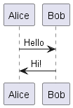

# alpha-auth

https://ash-uncover.github.io/alpha-auth/

## Usage

Install the project:

```
npm i
```

### NPM commands

| Command   | Sescription |
| -------   | ----------- |
| npm run build     | Build the project for production. |
| npm run build:dev | Build the project for development. |
| npm run start:dev | Starts a webpack dev-server in watch mode. Server is started on http://localhost:8080 |

## Features

### Authentication

<!--
@startuml firstDiagram

Alice -> Bob: Hello
Bob -> Alice: Hi!

@enduml
-->


### Registration

### Recovery
